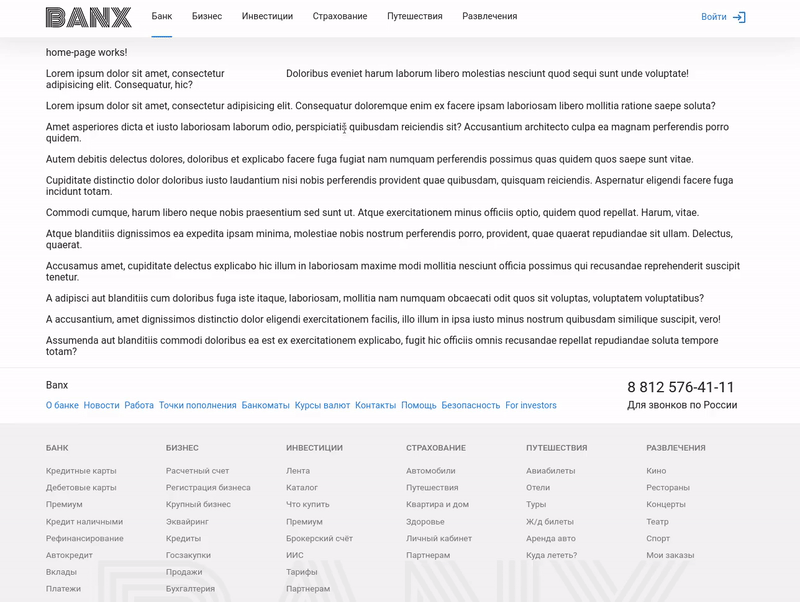

# Banx

Banx - учебный репозиторий, в котором предоставлен процесс разработки банковского приложения с использованием
монорепозитория Nx.

## Введение

В новом цикле статей мы будем рассматривать и создавать новое enterprise приложение на Angular по всем канонам Angular и
Nx.

В качестве проекта, мы будем реализовывать небольшое банковское приложение, которое будет представлено в нескольких
странах.

Что будет включать в себя приложение:

— Nx монорепозиторий для Angular — Ngrx реализация redux в Angular — l18n Angular localization

Основная цель данного цикла статей - показать полный цикл разработки приложения с использованием различных нюансов
фреймворка.

## Обзор

Ссылки на официальную документацию и цикл статей по разработке UI для банковского приложения.

Первые 14 статей посвящены первичной настройке монорепозитория. В этих статьях добавляются "core" модули - новые части
системы, которые в дальнейшем упростят работу с приложением.

Статья [Создание API NestJS+TypeOrm+Mariadb.](https://medium.com/fafnur/banx-%D1%81%D0%BE%D0%B7%D0%B4%D0%B0%D0%BD%D0%B8%D0%B5-api-nestjs-typeorm-mariadb-ac72fc3e28c7) 
 рассматривает разворачивание микро бекенда на NestJS в рамках монорепозитория NX.

Статья [Гибкие шаблоны с routerOutlet в Angular](https://medium.com/fafnur/banx-%D0%B3%D0%B8%D0%B1%D0%BA%D0%B8%D0%B5-%D1%88%D0%B0%D0%B1%D0%BB%D0%BE%D0%BD%D1%8B-%D1%81-routeroutlet-%D0%B2-angular-14ae64432cb6)
 рассматривает механизм работы с шаблонами и роутингом в Angular, который не очевиден с первого взгляда.

[Создание страницы авторизации и сброса пароля](https://medium.com/fafnur/banx-%D1%81%D0%BE%D0%B7%D0%B4%D0%B0%D0%BD%D0%B8%D0%B5-%D1%81%D1%82%D1%80%D0%B0%D0%BD%D0%B8%D1%86%D1%8B-%D0%B0%D0%B2%D1%82%D0%BE%D1%80%D0%B8%D0%B7%D0%B0%D1%86%D0%B8%D0%B8-%D0%B8-%D1%81%D0%B1%D1%80%D0%BE%D1%81%D0%B0-%D0%BF%D0%B0%D1%80%D0%BE%D0%BB%D1%8F-b293899e0d8e)
 пример разработки типовой функциональности в Angular.

Статья [Создание трекера событий пользователя в Angular](https://medium.com/fafnur/banx-%D1%81%D0%BE%D0%B7%D0%B4%D0%B0%D0%BD%D0%B8%D0%B5-%D1%82%D1%80%D0%B5%D0%BA%D0%B5%D1%80%D0%B0-%D1%81%D0%BE%D0%B1%D1%8B%D1%82%D0%B8%D0%B9-%D0%BF%D0%BE%D0%BB%D1%8C%D0%B7%D0%BE%D0%B2%D0%B0%D1%82%D0%B5%D0%BB%D1%8F-%D0%B2-angular-b5113a591ee8)
 демонстрирует один из сбособов сбора данных о пользователе. В данной статье приводится реализация трекера на Angular, а также пример его интеграции с приложением.

## Ссылки

Ниже представленны ссылки на официальную документацию и цикл статей в хронологическом порядке.

### Официальная документация

Для понимания того, что происходит в цикле статей Banx, рекомендую ознакомиться с официальной документацией используемых
технологий и подходов:

[Документация по Angular](https://angular.io/docs)

[Документация по Ngrx](https://ngrx.io/docs)

[Документация по RxJS](https://www.learnrxjs.io/)

[Документация по Nx](https://nx.dev/angular)

### Цикл статей

[Создание Nx workspace для Angular](https://medium.com/fafnur/banx-%D1%81%D0%BE%D0%B7%D0%B4%D0%B0%D0%BD%D0%B8%D0%B5-nx-workspace-%D0%B4%D0%BB%D1%8F-angular-26a12cc74e15)

[Настройка базовых правил в eslint в Nx в Angular](https://medium.com/fafnur/banx-%D0%BD%D0%B0%D1%81%D1%82%D1%80%D0%BE%D0%B9%D0%BA%D0%B0-%D0%B1%D0%B0%D0%B7%D0%BE%D0%B2%D1%8B%D1%85-%D0%BF%D1%80%D0%B0%D0%B2%D0%B8%D0%BB-%D0%B2-eslint-%D0%B2-nx-%D0%B2-angular-bc669f82e361)

- было актуально до 12 версии Angular

[Структура Angular приложения в монорепозитории Nx](https://medium.com/fafnur/banx-%D1%81%D1%82%D1%80%D1%83%D0%BA%D1%82%D1%83%D1%80%D0%B0-angular-%D0%BF%D1%80%D0%B8%D0%BB%D0%BE%D0%B6%D0%B5%D0%BD%D0%B8%D1%8F-%D0%B2-%D0%BC%D0%BE%D0%BD%D0%BE%D1%80%D0%B5%D0%BF%D0%BE%D0%B7%D0%B8%D1%82%D0%BE%D1%80%D0%B8%D0%B8-nx-18d70eea49b1)

[Организация стилей в Angular](https://medium.com/fafnur/banx-%D0%BE%D1%80%D0%B3%D0%B0%D0%BD%D0%B8%D0%B7%D0%B0%D1%86%D0%B8%D1%8F-%D1%81%D1%82%D0%B8%D0%BB%D0%B5%D0%B9-%D0%B2-angular-2833e2c4a42b)

[Создание базового лейаута в Angular](https://medium.com/fafnur/banx-%D1%81%D0%BE%D0%B7%D0%B4%D0%B0%D0%BD%D0%B8%D0%B5-%D0%B1%D0%B0%D0%B7%D0%BE%D0%B2%D0%BE%D0%B3%D0%BE-%D0%BB%D0%B5%D0%B9%D0%B0%D1%83%D1%82%D0%B0-%D0%B2-angular-6c01392bd85a)

[Основы верстки в Angular на примере создания страниц ошибок](https://medium.com/fafnur/banx-%D0%BE%D1%81%D0%BD%D0%BE%D0%B2%D1%8B-%D0%B2%D0%B5%D1%80%D1%81%D1%82%D0%BA%D0%B8-%D0%B2-angular-%D0%BD%D0%B0-%D0%BF%D1%80%D0%B8%D0%BC%D0%B5%D1%80%D0%B5-%D1%81%D0%BE%D0%B7%D0%B4%D0%B0%D0%BD%D0%B8%D1%8F-%D1%81%D1%82%D1%80%D0%B0%D0%BD%D0%B8%D1%86-%D0%BE%D1%88%D0%B8%D0%B1%D0%BE%D0%BA-f60afaa82996)

[Создание fake API с помощью json-server](https://medium.com/fafnur/banx-%D1%81%D0%BE%D0%B7%D0%B4%D0%B0%D0%BD%D0%B8%D0%B5-fake-api-%D1%81-%D0%BF%D0%BE%D0%BC%D0%BE%D1%89%D1%8C%D1%8E-json-server-49cf713dae36)

[Методы работы с LocalStorage, SessionStorage и Cookies](https://medium.com/fafnur/banx-%D0%BC%D0%B5%D1%82%D0%BE%D0%B4%D1%8B-%D1%80%D0%B0%D0%B1%D0%BE%D1%82%D1%8B-%D1%81-localstorage-sessionstorage-%D0%B8-cookies-703e43901d05)

[Config service и Environment service в Angular для Nx](https://medium.com/fafnur/banx-config-service-%D0%B8-environment-service-%D0%B2-angular-%D0%B4%D0%BB%D1%8F-nx-e19a3b1ff178)

[Работа с Http в Angular. Создание вспомогательных утилит для API](https://medium.com/fafnur/banx-%D1%80%D0%B0%D0%B1%D0%BE%D1%82%D0%B0-%D1%81-http-%D0%B2-angular-%D1%81%D0%BE%D0%B7%D0%B4%D0%B0%D0%BD%D0%B8%D0%B5-%D0%B2%D1%81%D0%BF%D0%BE%D0%BC%D0%BE%D0%B3%D0%B0%D1%82%D0%B5%D0%BB%D1%8C%D0%BD%D1%8B%D1%85-%D1%83%D1%82%D0%B8%D0%BB%D0%B8%D1%82-%D0%B4%D0%BB%D1%8F-api-885409c741c1)

[Подключение Ngrx в Angular. Создание RootStore](https://medium.com/fafnur/banx-%D0%BF%D0%BE%D0%B4%D0%BA%D0%BB%D1%8E%D1%87%D0%B5%D0%BD%D0%B8%D0%B5-ngrx-%D0%B2-angular-%D1%81%D0%BE%D0%B7%D0%B4%D0%B0%D0%BD%D0%B8%D0%B5-rootstore-d6efc81c7f87)

[Создание адаптивных колонок с помощью компонентов Angular.](https://medium.com/fafnur/banx-%D1%81%D0%BE%D0%B7%D0%B4%D0%B0%D0%BD%D0%B8%D0%B5-%D0%B0%D0%B4%D0%B0%D0%BF%D1%82%D0%B8%D0%B2%D0%BD%D1%8B%D1%85-%D0%BA%D0%BE%D0%BB%D0%BE%D0%BD%D0%BE%D0%BA-%D1%81-%D0%BF%D0%BE%D0%BC%D0%BE%D1%89%D1%8C%D1%8E-%D0%BA%D0%BE%D0%BC%D0%BF%D0%BE%D0%BD%D0%B5%D0%BD%D1%82%D0%BE%D0%B2-angular-cfe236054902)

[PlatformService как обертка над PLATFORM_ID](https://medium.com/fafnur/banx-platformservice-%D0%BA%D0%B0%D0%BA-%D0%BE%D0%B1%D0%B5%D1%80%D1%82%D0%BA%D0%B0-%D0%BD%D0%B0-platform-id-5abb760396e9)

[Обработка и вывод фраз с числительными в Angular.](https://medium.com/fafnur/banx-%D0%BE%D0%B1%D1%80%D0%B0%D0%B1%D0%BE%D1%82%D0%BA%D0%B0-%D0%B8-%D0%B2%D1%8B%D0%B2%D0%BE%D0%B4-%D1%84%D1%80%D0%B0%D0%B7-%D1%81-%D1%87%D0%B8%D1%81%D0%BB%D0%B8%D1%82%D0%B5%D0%BB%D1%8C%D0%BD%D1%8B%D0%BC%D0%B8-%D0%B2-angular-71303bb9d809)

[Создание API NestJS+TypeOrm+Mariadb.](https://medium.com/fafnur/banx-%D1%81%D0%BE%D0%B7%D0%B4%D0%B0%D0%BD%D0%B8%D0%B5-api-nestjs-typeorm-mariadb-ac72fc3e28c7)

[Гибкие шаблоны с routerOutlet в Angular](https://medium.com/fafnur/banx-%D0%B3%D0%B8%D0%B1%D0%BA%D0%B8%D0%B5-%D1%88%D0%B0%D0%B1%D0%BB%D0%BE%D0%BD%D1%8B-%D1%81-routeroutlet-%D0%B2-angular-14ae64432cb6)

[Создание страницы авторизации и сброса пароля](https://medium.com/fafnur/banx-%D1%81%D0%BE%D0%B7%D0%B4%D0%B0%D0%BD%D0%B8%D0%B5-%D1%81%D1%82%D1%80%D0%B0%D0%BD%D0%B8%D1%86%D1%8B-%D0%B0%D0%B2%D1%82%D0%BE%D1%80%D0%B8%D0%B7%D0%B0%D1%86%D0%B8%D0%B8-%D0%B8-%D1%81%D0%B1%D1%80%D0%BE%D1%81%D0%B0-%D0%BF%D0%B0%D1%80%D0%BE%D0%BB%D1%8F-b293899e0d8e)

[Создание трекера событий пользователя в Angular](https://medium.com/fafnur/banx-%D1%81%D0%BE%D0%B7%D0%B4%D0%B0%D0%BD%D0%B8%D0%B5-%D1%82%D1%80%D0%B5%D0%BA%D0%B5%D1%80%D0%B0-%D1%81%D0%BE%D0%B1%D1%8B%D1%82%D0%B8%D0%B9-%D0%BF%D0%BE%D0%BB%D1%8C%D0%B7%D0%BE%D0%B2%D0%B0%D1%82%D0%B5%D0%BB%D1%8F-%D0%B2-angular-b5113a591ee8)

